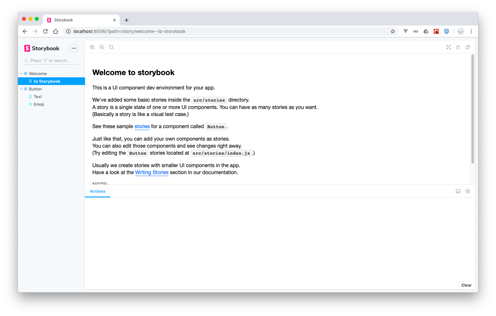

# Storybook Getting Started

Incorporating Storybook into an existing project

## Add or Initialize Storybook

To add Storybook to an existing project run the following:

```bash
npx -p @storybook/cli sb init
```

This outputs

```bash
$ npx -p @storybook/cli sb init

 sb init - the simplest way to add a storybook to your project. 

 • Detecting project type. ✓

> fsevents@1.2.9 install /path/to/storybook-getting-started/node_modules/fsevents
> node install

node-pre-gyp WARN Using needle for node-pre-gyp https download 
[fsevents] Success: "/path/to/storybook-getting-started/node_modules/fsevents/lib/binding/Release/node-v64-darwin-x64/fse.node" is installed via remote

> core-js@2.6.9 postinstall /path/to/storybook-getting-started/node_modules/babel-runtime/node_modules/core-js
> node scripts/postinstall || echo "ignore"

Thank you for using core-js ( https://github.com/zloirock/core-js ) for polyfilling JavaScript standard library!

The project needs your help! Please consider supporting of core-js on Open Collective or Patreon: 
> https://opencollective.com/core-js 
> https://www.patreon.com/zloirock 

Also, the author of core-js ( https://github.com/zloirock ) is looking for a good job -)


> core-js@3.2.1 postinstall /path/to/storybook-getting-started/node_modules/core-js
> node scripts/postinstall || echo "ignore"

Thank you for using core-js ( https://github.com/zloirock/core-js ) for polyfilling JavaScript standard library!

The project needs your help! Please consider supporting of core-js on Open Collective or Patreon: 
> https://opencollective.com/core-js 
> https://www.patreon.com/zloirock 

Also, the author of core-js ( https://github.com/zloirock ) is looking for a good job -)


> core-js-pure@3.2.1 postinstall /path/to/storybook-getting-started/node_modules/core-js-pure
> node scripts/postinstall || echo "ignore"

Thank you for using core-js ( https://github.com/zloirock/core-js ) for polyfilling JavaScript standard library!

The project needs your help! Please consider supporting of core-js on Open Collective or Patreon: 
> https://opencollective.com/core-js 
> https://www.patreon.com/zloirock 

Also, the author of core-js ( https://github.com/zloirock ) is looking for a good job -)

npm WARN ts-pnp@1.1.4 requires a peer of typescript@* but none is installed. You must install peer dependencies yourself.
npm WARN storybook-getting-started@1.0.0 No repository field.

+ @storybook/addons@5.2.1
+ @storybook/react@5.2.1
+ @storybook/addon-links@5.2.1
+ @storybook/addon-actions@5.2.1
added 1224 packages from 881 contributors and audited 35100 packages in 79.885s
found 521 high severity vulnerabilities
  run `npm audit fix` to fix them, or `npm audit` for details
. ✓
 • Preparing to install dependencies. ✓


> core-js@2.6.9 postinstall /path/to/storybook-getting-started/node_modules/@storybook/addon-info/node_modules/core-js
> node scripts/postinstall || echo "ignore"

Thank you for using core-js ( https://github.com/zloirock/core-js ) for polyfilling JavaScript standard library!

The project needs your help! Please consider supporting of core-js on Open Collective or Patreon: 
> https://opencollective.com/core-js 
> https://www.patreon.com/zloirock 

Also, the author of core-js ( https://github.com/zloirock ) is looking for a good job -)


> core-js@2.6.9 postinstall /path/to/storybook-getting-started/node_modules/@storybook/addon-knobs/node_modules/core-js
> node scripts/postinstall || echo "ignore"

Thank you for using core-js ( https://github.com/zloirock/core-js ) for polyfilling JavaScript standard library!

The project needs your help! Please consider supporting of core-js on Open Collective or Patreon: 
> https://opencollective.com/core-js 
> https://www.patreon.com/zloirock 

Also, the author of core-js ( https://github.com/zloirock ) is looking for a good job -)

npm WARN ts-pnp@1.1.4 requires a peer of typescript@* but none is installed. You must install peer dependencies yourself.
npm WARN storybook-getting-started@1.0.0 No repository field.

added 75 packages from 80 contributors and audited 36759 packages in 28.681s
found 537 vulnerabilities (1 moderate, 536 high)
  run `npm audit fix` to fix them, or `npm audit` for details

 • Installing dependencies. ✓

To run your storybook, type:

   npm run storybook 

For more information visit: https://storybook.js.org

```

Run the following command to start storybook

```bash
npm run storybook
```

A browser window opens showing the following:



Running the cli created the `.storybook` folder and added the following files:

- `addons.js`
- `config.js`

It also created a `stories` folder and produced a few sample stories:

- `0-Welcome.stories.js`
- `1-Button.stories.js`

It then updated the `package.json` file and added a few entries in the scripts section:

```json
  "scripts": {
    ...
    "storybook": "start-storybook -p 6006",
    "build-storybook": "build-storybook"
  },
```

## References

- [Storybook: Getting Started](https://app.pluralsight.com/library/courses/storybook-getting-started/table-of-contents)